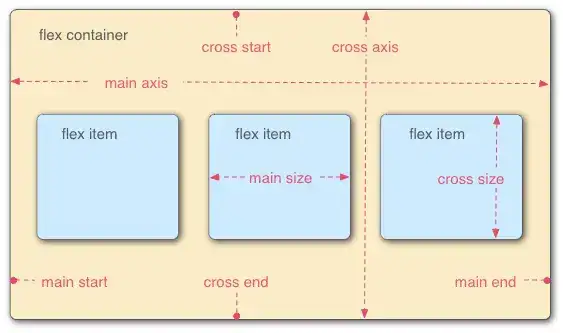
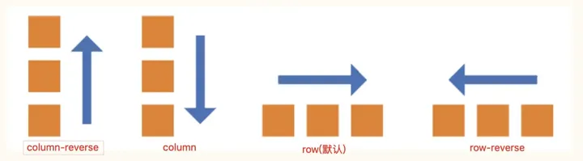
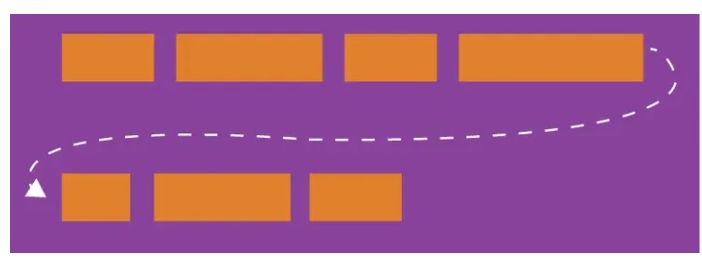
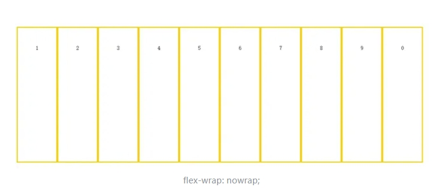
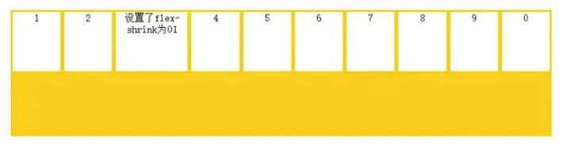
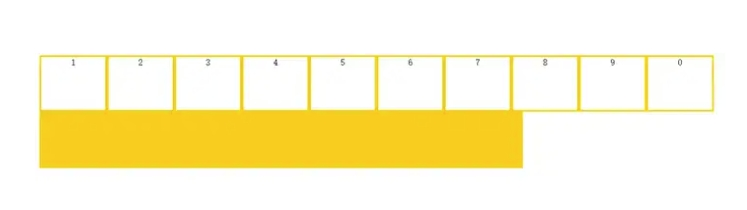
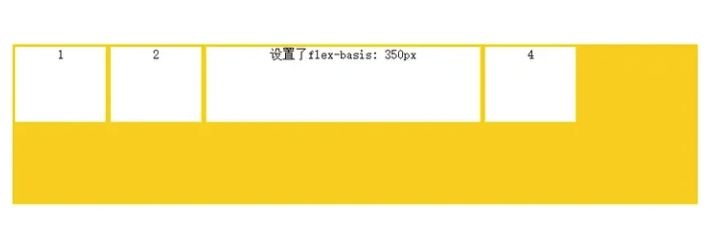
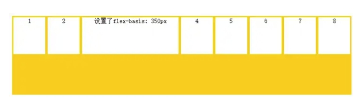

# flex 笔记
<!-- 超链接 -->
[MDN flex文档](https://developer.mozilla.org/zh-CN/docs/Web/CSS/flex)

**Flex 是 Flexible Box 的缩写，翻译成中文就是“弹性盒子”，用来为盒装模型提供最大的灵活性。任何一个容器都可以通过 display: flex;成为为 Flex 布局。
例如：**

```
.container{
  width: 100%;
  height: 100vh;
  background-color: #0f0;

  display: flex;
  flex-direction: column;
  justify-content: space-around;
  align-items: center;

}
```

**_采用 Flex 布局的元素，被称为 Flex 容器 flex container，简称“容器”。其所有子元素自动成为容器成员，成为 Flex 项目，即：Flex item，简称“项目”。_**

<!-- 图片 -->



容器默认存在两根主轴：水平方向主轴(main axis)和垂直方向交叉轴(cross axis)，默认项目按**_主轴
排列。_**

## Flex 的

> 设置在容器上的属性有 6 种:

```
flex-direction属性：决定主轴的方向（即项目的排列方向）
flex-wrap属性：定义换行情况
flex-flow属性：flex-direction和flex-wrap的简写，默认row nowrap
justify-content属性：定义项目在主轴上的对齐方式。
align-items属性：定义在交叉轴上的对齐方式
align-content属性：定义多根轴线的对齐方式
```

### flex-direction 的

> -flex-direction 属性：决定主轴的方向。

```
flex-direction属性：决定主轴的方向。说白了就是该属性用来控制项目的排列方向。该属性可取值如下：row 、row-reverse 、column 或 column-reverse;
row（默认）：主轴水平方向，起点在左端；
row-reverse：主轴水平方向，起点在右端；
column：主轴垂直方向，起点在上边沿；
column-reserve：主轴垂直方向，起点在下边沿。
```

<!-- 图片 -->



### flex-wrap 的

> flex-wrap 属性 ： 默认情况下，当一条轴线排不下时，会换到下一行。flex-wrap 属性允许子元素换行。

```
默认：nowrap ：不换行；
wrap：换行；
wrap-reverse：换行，但第一行在下方。
```

>  wrap 换行



>  nowrap 不换行



>  wrap-reverse 换行，但第一行在下方。


### flex-flow

> flex-flow 属性：flex-direction 和 flex-wrap 的简写，默认 row nowrap

```
flex-flow: row nowrap; 解释： 默认值
flex-flow: row wrap; 解释：换行
flex-flow: row wrap-reverse; 解释：换行，但第一行在下方。
flex-flow: column nowrap; 解释：从上到下排列
flex-flow: column wrap; 解释：从上到下排列，换行
```

### justify-content

> justify-content 属性：定义项目在主轴上的对齐方式。

```
justify-content属性：定义项目在主轴上的对齐方式。该属性可取值如下：start 、end、flex-start 、flex-end、 center 、 left、right、space-between 、 space-around 、space-evenly 、stretch、safe 、 unsafe 、 baseline 、 first baseline、 last baseline;

flex-start（默认值）：左对齐
flex-end：右对齐；
center：居中；
space-between：两端对齐，项目之间间隔相等；
space-around：每个项目两侧的间隔相等，即项目之间的间隔比项目与边框的间隔大一倍。
```

**提示：对齐方式与轴的方向有关，本文中假设主轴从左到右。**

### align-items

> align-items 定义项目在交叉轴上如何对齐

```
align-items属性：定义在交叉轴上的对齐方式。该属性可取值如下：flex-start 、flex-end 、center 、baseline 、 stretch;
stretch（默认值）：如果项目未设置高度或设为auto，将占满整个容器的高度。
flex-start：起点对齐；
flex-end：终点对齐；
center：中点对齐；
baseline：项目的第一行文字的基线对齐；
```

**提示：对齐方式与交叉轴的方向有关，假设交叉轴从下到上。**

### align-content

> 定义了多根轴线的对齐方式。如果项目只有一根轴线，该属性不起作用。

```
align-content属性：定义多根轴线的对齐方式。如果项目只有一根轴线，该属性不起作用。所以，容器必须设置flex-wrap：···；。即必须设置换行样式后，该属性才有意义。该属性可取值如下：flex-start 、flex-end 、center 、 space-between 、 space-around 、 stretch;

flex-start：与交叉轴的起点对齐；
flex-end：与交叉轴的终点对齐；
center：与交叉轴的中点对齐；
space-between：与交叉轴的两端对齐，轴线之间的间隔平均分布；
space-around：每根轴线两侧的间隔相等，即轴线之间的间隔比轴线与边框的间隔大一倍；
stretch（默认值）：轴线占满整个交叉轴。
```

### 其他属性

> 设置在项目上的属性也有 6 个。

```
order属性：定义项目的排列顺序。
flex-grow属性：定义项目的放大比例
flex-shrink属性：定义项目的缩小比例
flex-basis属性：定义在分配多余空间之前，项目占据的主轴空间。
flex属性是flex-grow，flex-shrink和flex-basis的简写
align-self属性：允许单个项目与其他项目有不一样的对齐方式
```

> order属性：定义项目的排列顺序。

order属性定义项目的排列顺序。数值越小，排列越靠前，默认为0,可以设置为负值。

> flex-grow属性：定义项目的放大比例，默认为0，即如果存在剩余空间，也不放大。

```flex-grow属性定义项目的放大比例，默认为0，即如果存在剩余空间，也不放大。如果所有项目的flex-grow属性都为1，则它们将等分剩余空间（如果有的话）。如果一个项目的flex-grow属性为2，其他项目都为1，则前者占据的剩余空间将比其他项多一倍。```


>  flex-shrink 属性

flex-shrink定义了项目的缩小比例，默认为1，即如果空间不足，该项目将缩小。如果所有项目的flex-shrink属性都为1，当空间不足时，都将等比例缩小。如果一个项目的flex-shrink属性为0，其他项目都为1，则空间不足时，前者不缩小。





如果所有项目都为0，则当空间不足时，项目撑破容器而溢出。



> flex-basis属性：定义在分配多余空间之前，项目占据的主轴空间。

flex-basis属性：定义在分配多余空间之前，项目占据的主轴空间。默认值为auto，浏览器根据此属性检查主轴是否有多余空间。

注意：设置的flex-basis是分配多余空间之前项目占据的主轴空间，如果空间不足则默认情况下该项目也会缩小。




空间不足，项目缩小，小于设定值：




***flex属性是flex-grow，flex-shrink和flex-basis的简写***

flex属性是flex-grow，flex-shrink和flex-basis的简写。默认值为0 1 auto，第一个属性必须，后两个属性可选。
可以用flex:auto;代替 flex: 1 1 auto；
可以用flex: none;代替 flex: 0 0 auto；


align-self属性：允许单个项目与其他项目有不一样的对齐方式
align-self属性：允许单个项目与其他项目有不一样的对齐方式。默认值为auto，表示继承父元素的align-items属性，并可以覆盖align-items属性。
