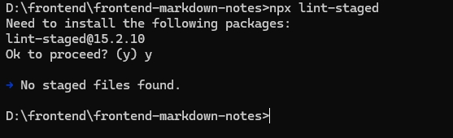
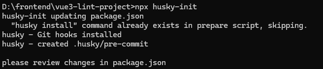

# husky & lint-staged

> husky 介绍

**_ husky 是一个用于 `Git 钩子`的现代化解决方案。它允许你在 `Git 提交之前执行一些脚本或任务`，例如`代码格式化、代码质量检查（linting）、测试`等。与传统的直接在 .git/hooks 目录下放置脚本不同，husky 使用 `Node.js`_ 编写，简化了安装和管理过程，并且提供了更好的`跨平台支持`。\***

> lint-staged 介绍

**\_ lint-staged 是一个工具，可以针对`暂存（staged）的 Git 文件`运行 `linter`，从而只对即将提交的变更部分应用 linting。这对于提高开发效率特别有用，因为它`避免了在每次提交前对整个项目进行 linting`，而只针对`即将提交`的部分。\***

> lint-staged 配置

```json
// packpack.json新增配置
  "lint-staged": {
    "src/**/*.{js.html.css.vue}": "prettier --write",
    "src/**/*.{js,vue}": "eslint --fix"
  }
```

<!-- 解释上面的json配置 -->

**`lint-staged`**

`lint-staged` 配置了 `prettier` 和 `eslint` 的自动格式化，当修改了 `js` 和 `vue` 文件时，`prettier` 会自动格式化，当修改了 `js` 和 `vue` 文件时，`eslint` 会自动格式化。

```shell
npx lint-staged
```

<!-- 图片 -->



### 初始化 husky

```shell
npm install husky --save-dev
npx husky-init
```


