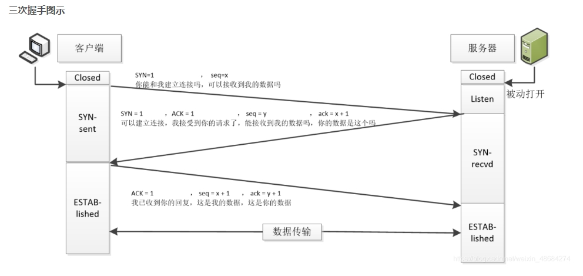
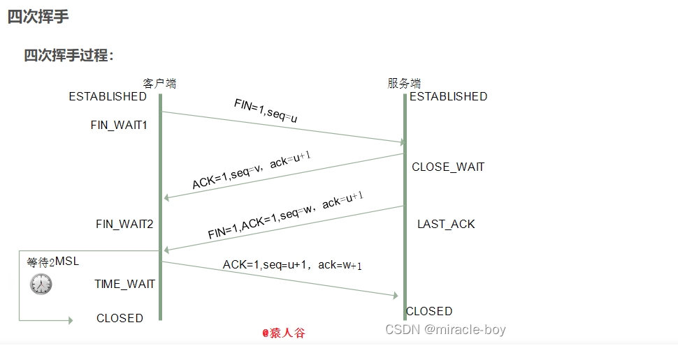

### Tcp 三次握手

> TCP 是基于 TCP/IP 协议的传输层协议，用于在网络中传输数据。TCP 协议是面向连接的，即在发送数据之前，必须建立连接，然后再进行数据传输。TCP 协议提供了可靠、有序、不可变、不可重复的数据传输服务。

### 三次握手和四次挥手

#### 术语

- SYN:同步位(同步序列编号)
  - SYN=1:发送 SYN 包(表示进行一个链接请求)
  - SYN=0:发送 ACK 包(表示确认有效)
- ACK:确认位
  - ACK=1:发送 ACK 包(表示确认有效)
  - ACK=0:发送 ACK 包(确认无效)
- ack:确认号(对方发送序号+1)
- seq(sequence number):seq 序号(seq 序号，占 32 位，用来标识从 TCP 源端向目的端发送的字节流，发起方发送数据时对此进行标记。)

#### 三次握手过程

**_目的:因为三次握手才能保证双方具有接收和发送的能力_**

1. 客户端发送 SYN=1, seq=100
2. 服务端收到 SYN=1, seq=100, 发送 SYN=1, ACK=1, seq=100, ack=101
3. 客户端收到 SYN=1, seq=100, ACK=1, seq=100, ack=101, 发送 ACK=1, seq=101, ack=101
4. 服务端收到 ACK=1, seq=101, ack=101, 发送 ACK=1, seq=101, ack=101

**ack 序号，占 32 位，只有 ACK 标志位为 1 时，确认序号字段才有效，ack=seq+1**

<!-- 图片 -->

#### 四次挥手过程

1. 客户端发送 FIN=1, seq=100
2. 服务端收到 FIN=1, seq=100, 发送 ACK=1, seq=100, ack=101
3. 客户端收到 ACK=1, seq=100, ack=101, 发送 ACK=1, seq=101, ack=101
4. 服务端收到 ACK=1, seq=101, ack=101, 发送 FIN=1, seq=101, ack=101
5. 客户端收到 FIN=1, seq=101, ack=101, 发送 ACK=1, seq=102, ack=101
6. 服务端收到 ACK=1, seq=102, ack=101, 发送 ACK=1, seq=102, ack=101

